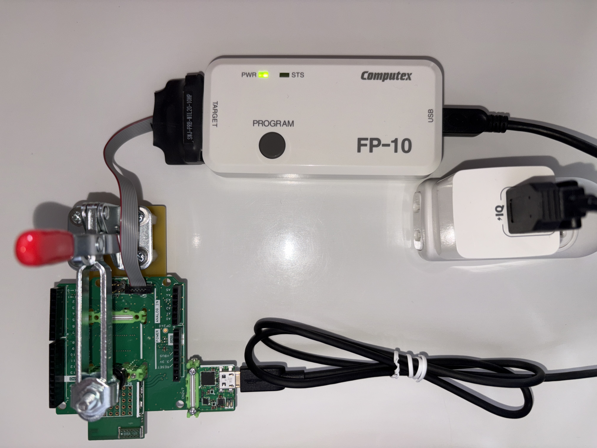
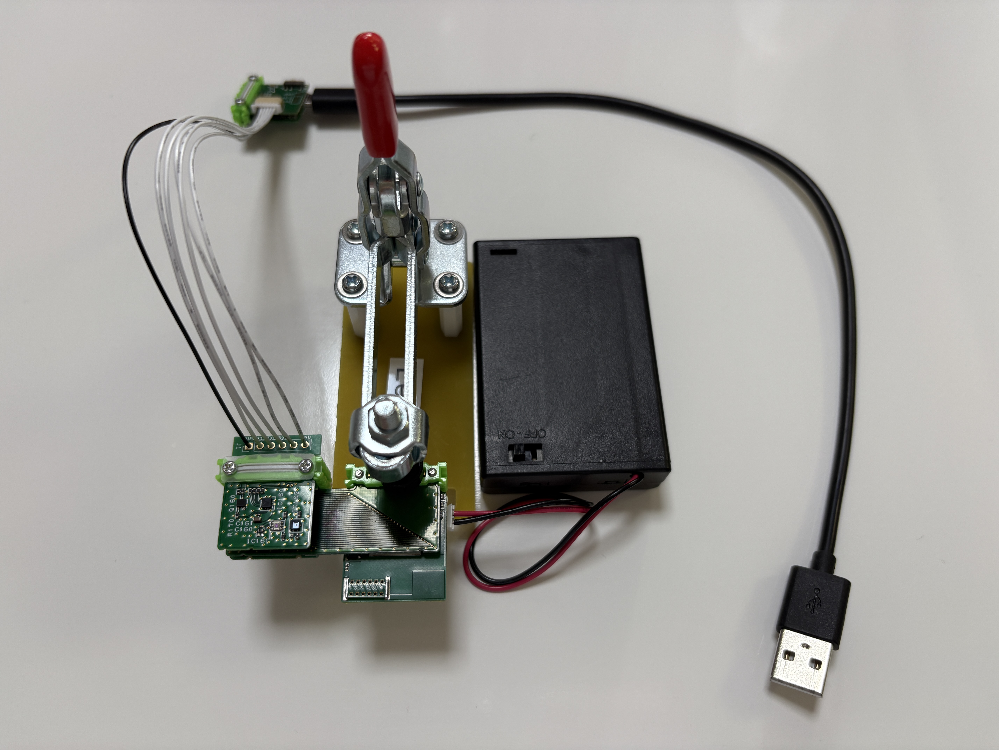
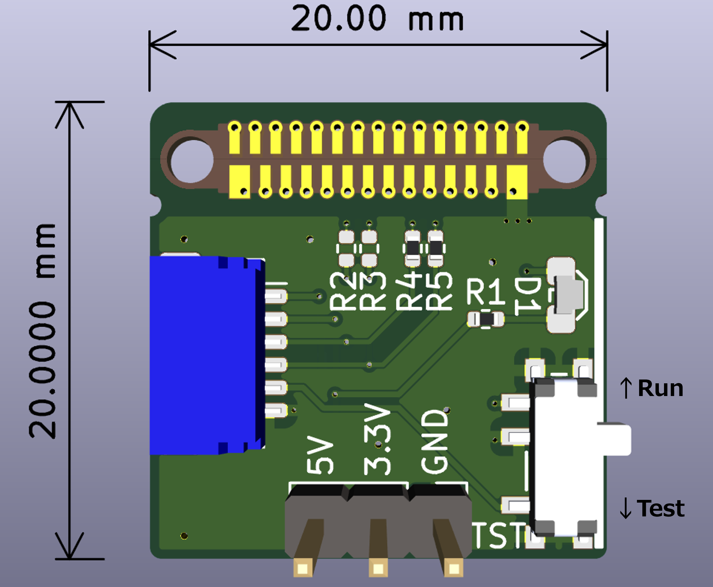

# FP-10/C-Flashを使ったFWの書き込み方
## はじめに
本内容は、AC07 LoRa MaryにFP-10/C-Flashを使ったFWの書き込み方を記します。
## 用意するもの
### AC07 LoRa Mary AS
* AC07 LoRa Mary
* AX01 Shield
* AX02 29 pin
* AZ01 USB
* Z63 Nut Plate
* M2X8mm ネジ
### その他
* リーフ組立て治具(Leafx3)
* USBケーブル(mini USBと micro USBの2種類)
* ACアダプター
* PC  [^1]
[^1]:FP-10へプログラムを書き込む時だけ必要で、LoRa Maryへの書き込み時は不要
## FP-10へプログラムの書き込み
* FP-10をPCに繋ぎ、C-Flashを立ち上げます。
* 設定→ターゲット設定をクリックします。
* 次に、マイコンを絞るこむため、メーカ名を指定し、フィルタはSTM32L07xxZを選択し、起動するをクリックします。
* 初期設定のタグで、ターゲットを未接続、インターフェースはSWD、1MHzを選択します。
* ファイル→ロード→追加をクリックし、v1.2.3のbinファイルを指定します。
* Flash開始アドレスは 0x08000000 なので、ロード・アドレスを0x08000000にします。
* データ→書き込みで、FP-10へプログラムを書き込みます。
## 組立て


|Stack No| Leaf | 
| :---  | :--- | 
|1 | AX02 29 pin |
|2|  AC07 LoRa Mary| 
|3|  AX01 Shield| 
* **29 pinのコネクタは、外して使用します。**
* USBリーフは、LoRa Maryに電源を供給するために使用します。

## LoRa Maryへの書き込み
* FP-10をAC アダプターに接続します。
* LoRa MaryとUSBをShieldにネジ止めし、AC アダプターに接続します。
* ShieldのSWDにFP-10を繋げます。
* FP-10のPROGRAMボタンをクリックします。STSのLEDが約10秒間点滅し、ピーと音がなり、点灯に変われば、OKです。

# AC07 LoRa Mary/AV06 1.8V～5.5V 検査手順
## はじめに
本内容は、AC07 LoRa MaryとAV06 1.8V～5.5Vを同時に検査する手順を記します。
## 用意するもの
### AC07 LoRa Mary/AV06 1.8V～5.5V AS
* AP03 STM32 MCU
* AC07 LoRa Mary[^2]
* AI01 4-Sensors
* AV06 1.8V～5.5V[^2]
* AX03 Leaf x2
* [2.54x6P through hole](https://github.com/Leafony/HW-Design-Files/tree/master/2.54x6P_through_hole)
* AZ63 Nut Plate
* M2X14mm ネジ
[^2]:検査対象のリーフ
### Solar-charger-debugger AS
* [Solar-charger-debugger-Leaf](https://github.com/Leafony/HW-Design-Files/tree/master/Solar-charger-debugger-Leaf) [^3]
* AZ01 USB
* AZ63 Nut Plate
* M2X8mm  
[^3]:Solar-charger-debugger-Leafは、高さ約3mmなので必ず上段にします。
### その他
* SORACOM plan-D
* リーフ組立て治具(Leafx3)
* 単３x３本電池ボックス
* PC
* テスター
## ソースコード
* [STM32_LoRa_4-Sensors_Transmitter](https://github.com/Leafony/Sample-Sketches/tree/master/STM32_LoRa_4-Sensors_Transmitter)
## 組立て


**AC07 LoRa Mary/AV06 1.8V～5.5V AS**</br>

|Stack No| Left Side Leaf| Right Side Leaf |
| :---:  | :--- | :--- |
|1 |   AI01 4-Sensors | － |
|2|  [2.54x6P through hole](https://github.com/Leafony/HW-Design-Files/tree/master/2.54x6P_through_hole) | － | 
|3|  AX03 Leaf x2 | AX03 Leaf x2| 
|4|  AP03 STM32 MCU | AC07 LoRa Mary[^1] | 
|5|  － | AV06 1.8V～5.5V[^1] | 

**Solar-charger-debugger AS**</br>

|Stack No| Leaf | 
| :---  | :--- | 
|1 |   [Solar-charger-debugger-Leaf](https://github.com/Leafony/HW-Design-Files/tree/master/Solar-charger-debugger-Leaf) |
|2|  AZ01 USB| 
## 検査方法
1.Solar-charger-debuggerをRunモードにします。



2.Solar-charger-debugger-Leafにテスターを当て、3.3V±0.3Vを確認します。
 
3.Arduino IDEのシリアルモニタを開き、ボーレートを115200bpsにします。[^3]
[^3]:Arduino IDEの設定に関して、[こちら](https://docs.leafony.com/docs/environment/stm32/arduino_ide/)を参照願います。

4.STM32 MCUの[リセットスイッチ](https://docs.leafony.com/docs/environment/stm32/arduino_ide/#%E3%83%9E%E3%82%A4%E3%82%B3%E3%83%B3%E3%83%9C%E3%83%BC%E3%83%89%E3%81%AE%E5%8B%95%E4%BD%9C%E7%A2%BA%E8%AA%8D)を押すと、以下のように表示出来ればOKです。

```
Starting LoRa 4-Sensors Transmitter...
Initializing sensors...
Sensors initialized.
Successfully started!
Sending packet... 
Wakeup Sensors.
3.89V,30.97℃,49.99%,181.60lx,0.05g,0.03g,0.97g
end!
```
