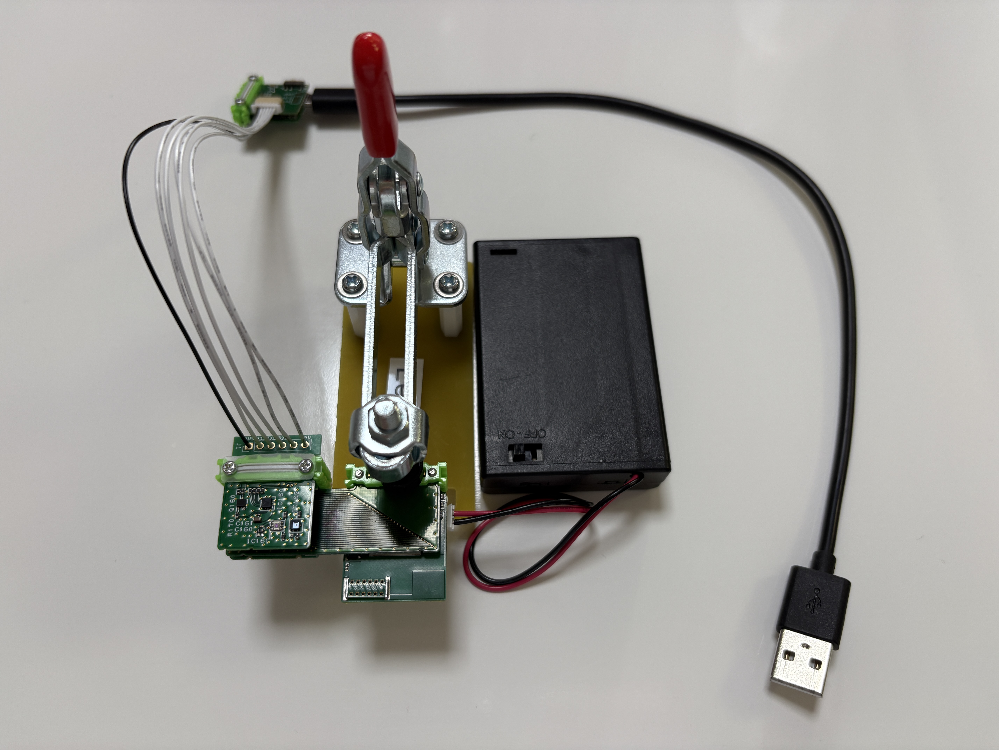
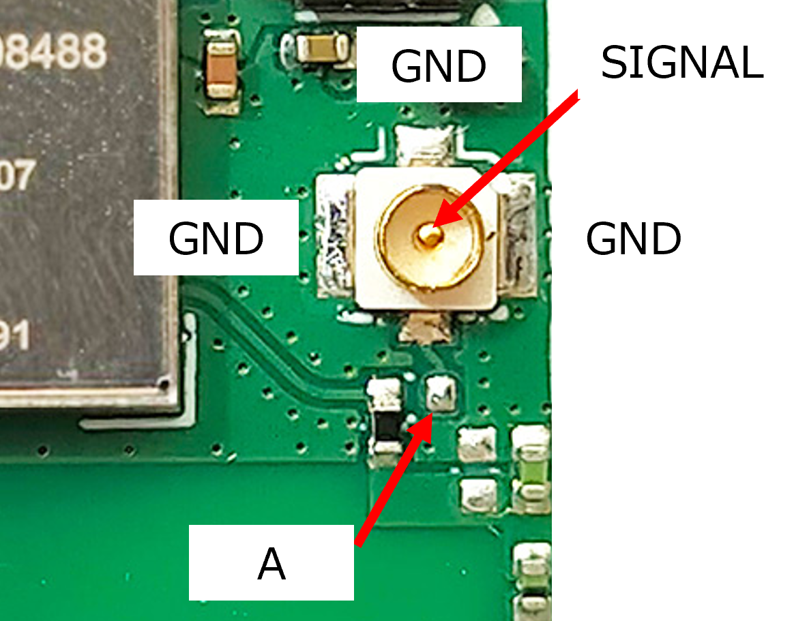

# LTE-M Mary/1.8V～5.5V 検査手順
## はじめに
本内容は、LTE-M Maryと1.8V～5.5Vを同時に検査する手順を記します。
## 用意するもの
### LTE-M Mary/1.8V～5.5V AS
* AP03 STM32 MCU
* AC08 LTE-M Mary[^1]
* AI01 4-Sensors
* AV06 1.8V～5.5V[^1]
* AX03 Leaf x2
* [2.54x6P through hole](https://github.com/Leafony/HW-Design-Files/tree/master/2.54x6P_through_hole)　6p-SHコネクタ・ケーブル付き
* AZ63 Nut Plate
* M2X14mm ネジ
[^1]:検査対象のリーフ
### Solar-charger-debugger AS
* [Solar-charger-debugger-Leaf](https://github.com/Leafony/HW-Design-Files/tree/master/Solar-charger-debugger-Leaf) [^2]
* AZ01 USB
* AZ63 Nut Plate
* M2X8mm ネジ
* USBケーブル 
[^2]:Solar-charger-debugger-Leafは、高さ約3mmなので必ず上段にします。
### その他
* PC
* テスター
* リーフ組立て治具(Leafx3)
* 単３x３本電池ボックス
* SORACOM plan-D

## ソースコード
* [STM32_4-Sensors_upload_tcp_docomo](https://github.com/Leafony/Sample-Sketches/tree/master/STM32_4-Sensors_upload_tcp_docomo)
## 組立て


**LTE-M Mary/1.8V～5.5V AS**</br>

* AX03 Leaf x2の右側のコネクタは、外して使用します。
* AC08 LTE-M Maryには、SORACOM plan-DのSIMを差し込みます。

|Stack No| Left Side Leaf| Right Side Leaf |
| :---:  | :--- | :--- |
|1 |   AI01 4-Sensors | － |
|2|  [2.54x6P through hole](https://github.com/Leafony/HW-Design-Files/tree/master/2.54x6P_through_hole) | － | 
|3|  AX03 Leaf x2 | AX03 Leaf x2| 
|4|  AP03 STM32 MCU | AC08 LTE-M Mary[^1] | 
|5|  － | AV06 1.8V～5.5V[^1] | 

**Solar-charger-debugger AS**</br>

|Stack No| Leaf | 
| :---  | :--- | 
|1 |   [Solar-charger-debugger-Leaf](https://github.com/Leafony/HW-Design-Files/tree/master/Solar-charger-debugger-Leaf) |
|2|  AZ01 USB| 
## 検査方法
1.Solar-charger-debuggerをRunモードにします。


2.Solar-charger-debugger-Leafにテスターを当て、3.3V±0.3Vを確認します。（**初回のみ、2回目以降は省略**)
 
3.Arduino IDEのシリアルモニタを開き、ボーレートを115200bpsにします。[^3]
[^3]:Arduino IDEの設定に関して、[こちら](https://docs.leafony.com/docs/environment/stm32/arduino_ide/)を参照願います。

4.STM32 MCUの[リセットスイッチ](https://docs.leafony.com/docs/environment/stm32/arduino_ide/#%E3%83%9E%E3%82%A4%E3%82%B3%E3%83%B3%E3%83%9C%E3%83%BC%E3%83%89%E3%81%AE%E5%8B%95%E4%BD%9C%E7%A2%BA%E8%AA%8D)を押すと、以下のように表示出来ればOKです。

```
@@@@@ MurataLpwaCore::����n() init 1st time
<info> lpwa device power_up
<info> lpwa device ready.
Starting Arduino tcp client  ======================
<info> lpwa device ready.
<info> PDP: idle
<info> PDP: connect
LPWA connected
Signal Strength: -91.00dBm
time: 25/05/14,09:23:12+36
29.54[degC], 50.94[%]
Illuminance: 145.56
volt: 3.89
<info> TCP socket connected
connected
201
disconnecting.
<info> UDP socket closed
lpwaAccess end
<info> lpwa device power_down
Starting deep sleep for 600 sec
```
## 同軸コネクタの導通チェック
1.A点と同軸コネクタのSIGNAL部分にテスターで導通を確認します。

2.A点とGND部分(3ヶ所)にテスターでショートしていないか確認します。




